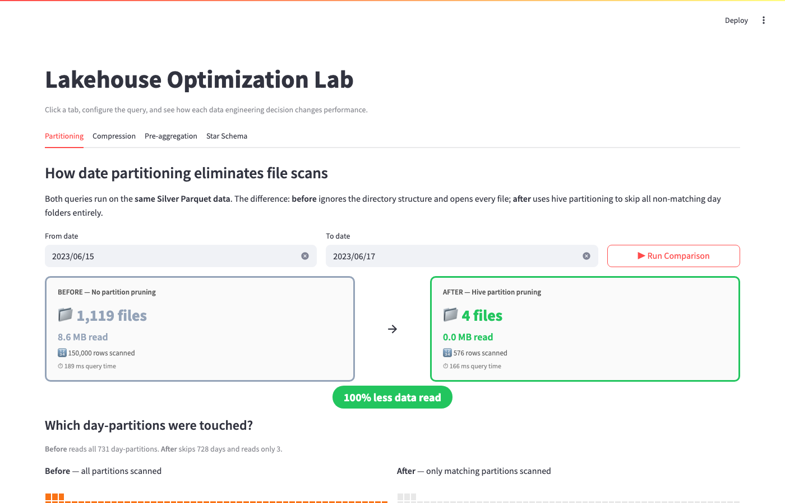
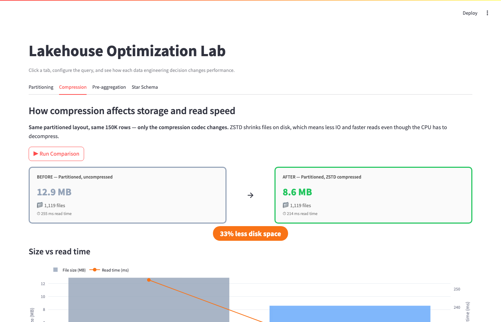
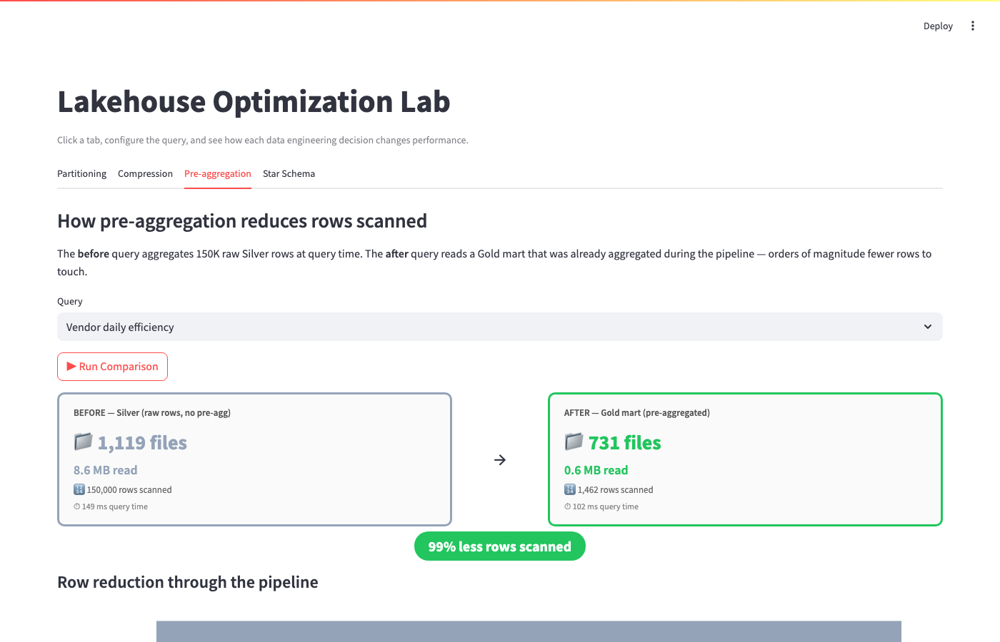
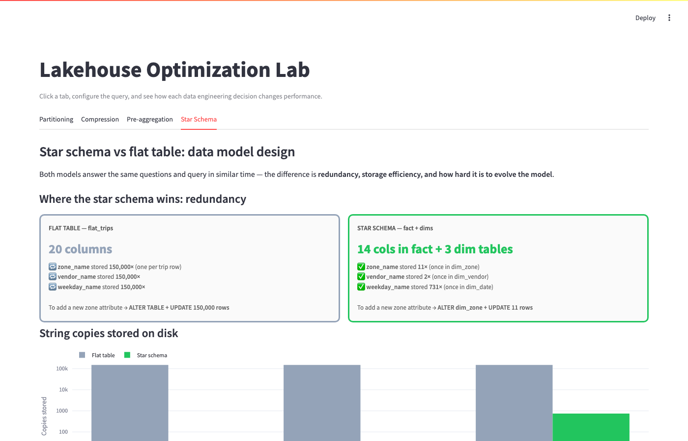

# Lakehouse Optimization Lab

An interactive demo that makes lakehouse data engineering decisions **visible**. Pick an optimization, run a query, and watch the before/after metrics update live — files opened, MB read, rows scanned.

Built on synthetic NYC taxi data (150K trips, 2023–2024) using DuckDB + Parquet + Streamlit. No cloud account needed — everything runs locally.

---

## Table of contents

- [What it demonstrates](#what-it-demonstrates)
- [Screenshots](#screenshots)
- [Quick start](#quick-start)
- [Architecture](#architecture)
- [Stack](#stack)
- [Data model](#data-model)
- [Partition pruning metric](#partition-pruning-metric)
- [Project structure](#project-structure)

---

## What it demonstrates

| Tab | Question answered | Key metric |
|---|---|---|
| **Partitioning** | How does hive partitioning reduce file scans? | 1,119 files → 4 files for a 3-day query |
| **Incremental Processing** | How much work is avoided by loading only new/late data? | Full rebuild partitions vs only impacted day partitions |
| **Compression** | What does ZSTD actually save? | 12.9 MB → 8.6 MB, same layout |
| **Pre-aggregation** | How does a Gold mart cut rows scanned? | 150,000 rows → 1,462 rows (99% less) |
| **Star Schema** | Why normalize? | `zone_name` stored 150,000× vs 11× |

---

## Screenshots

### Partitioning — 1,119 files collapsed to 4
Filter to a 3-day window. The before query opens every file; the after uses the hive directory structure to skip 728 day-partitions entirely.



---

### Compression — 33% less disk, same layout
Same partitioned Parquet, same 150K rows — only the codec changes. ZSTD reduces IO which more than offsets the decompression CPU cost.



---

### Pre-aggregation — 99% fewer rows scanned
The Silver layer holds 150,000 raw trip rows. The Gold mart pre-aggregated them at pipeline time — the same business question now reads only 1,462 rows from disk.



---

### Star Schema — redundancy and model evolution
Both models answer identical queries in similar time. The difference is maintainability: `zone_name` is stored once in `dim_zone` (11 rows) vs copied into every trip row (150,000 times). Adding a new zone attribute costs `UPDATE 11 rows` vs `UPDATE 150,000 rows`.



---

## Quick start

### Prerequisites

- Python 3.10+
- `pip` and `venv` available in your shell

### Setup and run

```bash
python3 -m venv .venv
source .venv/bin/activate
pip install -r requirements.txt

# Generate all data layers (~30 seconds)
python scripts/build_lakehouse.py

# Launch the dashboard
streamlit run app/dashboard.py
```

Open **http://localhost:8501**. Select a date range of 2–3 days on the Partitioning tab to see the most dramatic contrast.

### Useful commands

```bash
# Regenerate dashboard screenshots after launching Streamlit
python scripts/take_screenshots.py

# Clean generated data and rebuild from scratch
rm -rf data && python scripts/build_lakehouse.py
```

---

## Architecture

```
scripts/build_lakehouse.py
│
├── Raw CSV    data/raw/generated/nyc_taxi_trips.csv
│             150K synthetic NYC taxi trips, 2023–2024
│
├── Bronze     data/lake/bronze/trips/
│             Parquet, partitioned by year/month/day, ZSTD
│
├── Silver     data/lake/silver/trips/
│             Cleaned + tip_rate column, same partitioning
│
├── Silver     data/lake/silver_uncompressed/trips/
│             Same as Silver, uncompressed (Tab 2 baseline)
│
├── Flat       data/lake/flat/trips.parquet
│             Single unpartitioned file (Tab 1 baseline)
│
├── Gold       data/lake/gold/zone_hourly_profitability/
│             Pre-aggregated by zone + hour, partitioned by date
│
├── Gold       data/lake/gold/vendor_daily_efficiency/
│             Pre-aggregated by vendor, partitioned by date
│
└── Warehouse  data/warehouse/lakehouse.duckdb
              Star schema: fact_trips + dim_zone + dim_vendor + dim_date
              flat_trips: denormalized table (Tab 4 baseline)
```

### Stack

- **DuckDB 1.4** — query engine across all layers (Parquet + in-memory warehouse)
- **Parquet + ZSTD** — columnar storage with hive-style partitioning
- **Streamlit** — dashboard UI
- **Plotly** — partition heatmap, compression chart, funnel chart, redundancy chart

---

## Data model

```
fact_trips ──── dim_zone    (11 NYC zones, pickup + dropoff lookup)
           ──── dim_vendor  (2 vendors: Creative Mobile, Curb Mobility)
           └─── dim_date    (731 days with holiday + rainstorm flags)
```

Synthetic data is seeded for reproducibility (`seed=7`). Patterns modelled:

- Peak-hour surge pricing (1.35× at 7–9 AM, 1.28× at 4–7 PM)
- Vendor fare differential (Vendor 1 charges 4% more per mile)
- Tip rate drops at night (1–5 AM) and during rainstorms (−3 pp)
- 4 holidays and 4 rainstorm dates per year

---

## Partition pruning metric

Running the build script prints:

```
YoY-style filter scans 0.27% of day partitions (2/731).
```

This is the measurable payoff of date partitioning — a year-over-year query touches 2 day-folders out of 731 instead of reading every file.

---

## Project structure

```
├── app/
│   ├── dashboard.py        Streamlit Optimization Lab (5 tabs)
│   └── utils.py            Shared helpers: timing, file counts, chart builders
├── scripts/
│   ├── build_lakehouse.py  Full pipeline: raw → bronze → silver → gold → DuckDB
│   └── take_screenshots.py Playwright script to capture dashboard screenshots
├── sql/
│   ├── star_schema.sql     Table definitions
│   └── analytics_queries.sql  Business queries used by the dashboard
├── screenshots/            Auto-generated dashboard screenshots
└── data/                   Generated at build time (gitignored)
```
